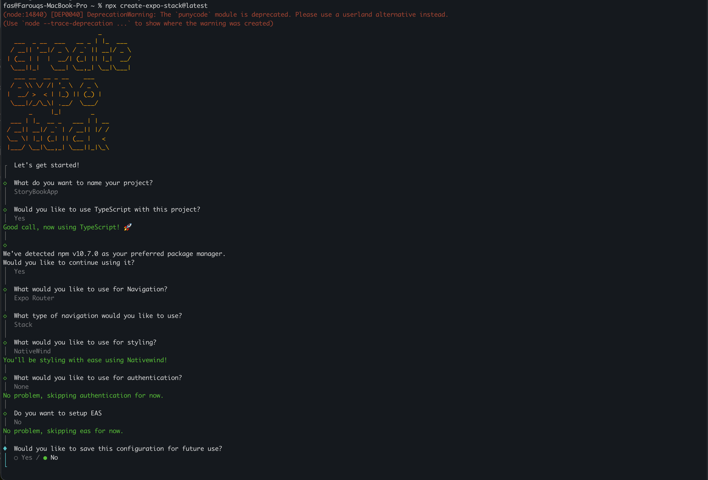
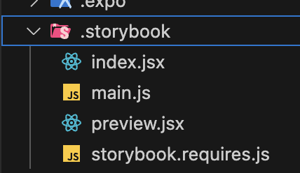
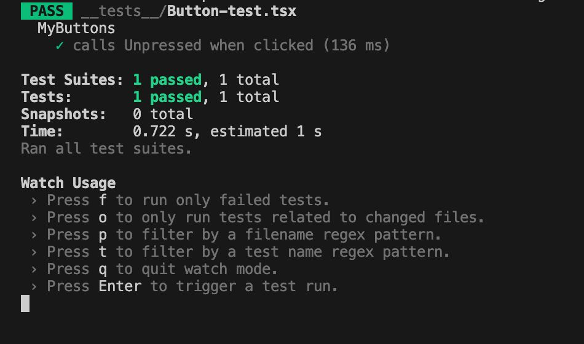
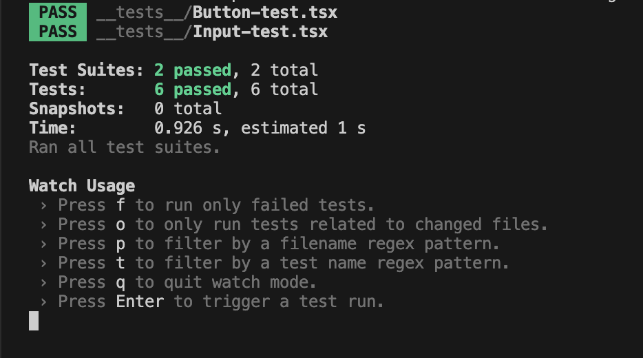

<p align="center">
  <a href="https://storybook.js.org/">
    
  </a>
</p>

<h1 align="center">
 FasTheDeveloper's Guide to Component Driven Development with Storybook React Native
</h1>

<h3 align="center">
React Native • TypeScript • Expo • Expo Router • StoryBook • Jest 
</h3>

## 🚀 Introduction

Welcome to this comprehensive, beginner-friendly guide on component-driven development using Storybook UI in React Native. This tutorial leverages the power of Expo, Tailwind and Storybook to provide a robust learning experience.

## 🎯 What You'll Learn

1. Core principles of component-driven development
2. Harnessing Storybook UI to enhance your development workflow
3. Bootstrapping a React Native project with Tailwind
4. Seamlessly integrating Storybook UI into your Expo project
5. Crafting and showcasing reusable components
6. Industry best practices for component-driven development

## 🛠 Prerequisites

Before diving in, make sure you have:

- A basic understanding of JavaScript, Typescript and React Native
- Node.js and npm installed on your development machine
- Make sure you have completed the [React Native - Environment Setup](https://reactnative.dev/docs/environment-setup) instructions
- Your preferred code editor ready to go

## 📚 Tutorial Sections

1. **Introduction to Component-Driven Development**
2. **Setting Up Your Expo Project**
3. **Integrating Storybook UI**
4. **Creating Your First Component**
   - Crafting a Dynamic Button Component
   - Creating a Default Button Story
   - Creating Various Button Stories
   - Writing Jest Tests for the Button Component
5. **Creating a Dynamic TextInput Component**
   - Crafting a TextInput with Tailwind CSS
   - Creating a Default TextInput Story
   - Creating Various TextInput Stories
   - Writing Jest Tests for the TextInput Component
6. **Testing Your Components**
7. **More Component Examples**
8. **Implementing the TextInput and Button Component**

## Introduction to Component-Driven Development in React Native

Component-Driven Development (CDD) is an approach to building user interfaces that emphasizes creating applications from the "bottom up" using reusable components. This methodology is particularly well-suited for React Native development, given the framework's component-based architecture.

### What is Component-Driven Development?

CDD is a development methodology that focuses on building user interfaces by breaking them down into smaller, reusable components. These components are developed in isolation before being assembled into larger features and, ultimately, complete pages or screens.

Key principles of CDD include:

1. **Modularity**: Building UIs from discrete, reusable components.
2. **Isolation**: Developing and testing components independently.
3. **Composition**: Combining smaller components to create larger ones.
4. **Reusability**: Designing components for use across different parts of an application.

## Benefits for React Native Developers

Adopting CDD in React Native development offers several advantages:

1. **Improved Maintainability**: Smaller, self-contained components are easier to understand, update, and debug.
2. **Enhanced Reusability**: Well-designed components can be reused across different parts of your app or even in different projects.
3. **Easier Collaboration**: Teams can work on different components simultaneously without conflicts.
4. **Consistent Design**: Using a library of standard components ensures UI consistency throughout the app.
5. **Efficient Testing**: Components can be tested in isolation, making it easier to write and maintain unit tests.

## Implementing CDD in React Native

To implement CDD in your React Native project:

1. **Start Small**: Begin by identifying and building the smallest, most basic UI elements (buttons, inputs, etc.).
2. **Build a Component Library**: Create a collection of reusable components that can be shared across your application.
3. **Use Tools**: Leverage tools like Storybook to develop and showcase your components in isolation.
4. **Document Components**: Provide clear documentation for each component, including its props, usage examples, and any limitations.
5. **Test Components**: Write unit tests for each component to ensure they function correctly in isolation.

By adopting CDD, React Native developers can create more maintainable, scalable, and consistent mobile applications. This approach aligns well with React Native's philosophy and can significantly improve development efficiency and code quality.

## Getting Started

### Using My Repository

To quickly get started with the pre-configured environment, follow these steps:

1. Clone the repository using:
    ```shell
        git clone https://github.com/FastheDeveloper/RN_ComponentDrivenDevelopment_Storybook.git
    ```

2. Navigate to the project directory and install the dependencies by running:
    ```shell
        yarn
    
    # or

        npm install
    ```

### Setting Up from Scratch


1. Creating your expo react native application:
    ```shell
        npx create-expo-stack@latest
    ```
    Running the above command will create a boilerplate application after asking a few configuration questions.
    
    <!--  -->
    

    <br/>

2. Setup Storybook In The Project

    ```shell
        npx storybook@latest init
    ```
    This will add a new folder (.storybook) in your project directory
    <br/>
    <br/>
    

<br/>

3. Additional Configuration

    1. Create an app.config.js File:

    This configuration facilitates easy switching between Storybook UI for testing and the actual React Native application.
    <br/>
    This file defines the storybookEnabled constant based on the environment variable STORYBOOK_ENABLED. This helps determine whether to render Storybook or the main application.

    ```javascript
    
    export default ({ config }) => ({
        ...config,
        name: 'My_App_Name',  
        slug: 'My_App_Name', 
        extra: {
            storybookEnabled: process.env.STORYBOOK_ENABLED,
        },
    });
    ```

    2. Update package.json File:

    In the package.json file, add these Storybook scripts. We use these to pass that environment variable to our application, which swaps the entry point to the Storybook UI using cross-env to make sure this works on all platforms (Windows/macOS/Linux).


    ```json
    {
        "scripts": {
            "storybook": "cross-env STORYBOOK_ENABLED='true' expo start",
            "storybook:ios": "cross-env STORYBOOK_ENABLED='true' expo ios",
            "storybook:android": "cross-env STORYBOOK_ENABLED='true' expo android"
        }
    }
    ```

4. Setup Entry point (/app/index.tsx) with the env variable

    ```javascript
    import React from 'react'
    import { StyleSheet, Text, View } from 'react-native'
    import Constants from 'expo-constants'


    function Page() {
    return (
        <View style={styles.container}>
        <View style={styles.main}>
            <Text className="text-white">This is the first page of your app.</Text>
        </View>
        </View>
    )
    }

    let AppEntryPoint = Page  

    if (Constants?.expoConfig?.extra?.storybookEnabled === 'true') {
    const StorybookUI = require('../.storybook').default
    AppEntryPoint = () => {
        return (
        <View style={{ flex: 1 }}>
            <StorybookUI />
        </View>
        )
    }
    }

    export default AppEntryPoint

    ```

5. Run the App for Testing:

    To test the app, you can use one of the following commands depending on your target platform:

    ```shell 
        # Run on iOS
        yarn ios
    
    # or 
    
        # Run on Android
        yarn android
    ```

6. Run Storybook  to test :
    ```shell 
        # Run on iOS
        yarn storybook:ios
    
    # or 
    
        # Run on Android
        yarn storybook:android
    ```
   
<br/>
<br/>

<br/>
<br/>

## Creating a Dynamic Button Component
### Create Button with StyleSheet/Tailwind css, adding Jest testID to the pressable
```javascript
        import { ActivityIndicator, Pressable, StyleSheet, Text, View } from 'react-native'
        import React, { ComponentProps } from 'react'
        import { APP_COLOR } from '@constants/colorConstants'
        import { FontAwesome } from '@expo/vector-icons'

        type buttonProps = {
        loading?: boolean
        rightIcon?: keyof typeof FontAwesome.glyphMap
        leftIcon?: keyof typeof FontAwesome.glyphMap
        label: string
        } & ComponentProps<typeof Pressable>

        const AppButton = ({  loading, leftIcon, label, rightIcon, ...pressableProps }: buttonProps) => {
        const content = loading ? (
            <>
            <View
            
            // style={styles.loaderWrapper}
             className="justify-center h-6"
             >
                <ActivityIndicator size="small" color={'white'} animating={true} />
            </View>
            </>
        ) : (
            <>
            {leftIcon && (
                <View 
                //style={styles.leftIcon}
                className="absolute left-5"
                >
                <FontAwesome name={leftIcon} size={20} />
                </View>
            )}
            <Text 
            className="text-APP_COLOR-MAIN_WHITE text-center text-lg font-bold "
            //style={styles.buttonText}
            >
                {label}
            </Text>
            {rightIcon && (
                <View 
               // style={styles.rightIcon}
                className="absolute right-5"
                >
                <FontAwesome name={rightIcon} size={20} />
                </View>
            )}
            </>
        )
        return (
            <Pressable
            //style={styles.button}
            className="w-full flex justify-center  item-center bg-APP_COLOR-MAIN_GREEN rounded-3xl p-4 shadow-lg"
            {...pressableProps}
            testID="testClick"
            >
            {content}
            </Pressable>
        )
        }

        export default AppButton

        const styles = StyleSheet.create({
            button: {
                alignItems: 'center',
                backgroundColor: APP_COLOR.MAIN_GREEN,
                borderRadius: 24,
                elevation: 5,
                flexDirection: 'row',
                justifyContent: 'center',
                padding: 16,
                width: '100%',
                shadowColor: '#000',
                shadowOffset: {
                height: 2,
                width: 0,
                },
                shadowOpacity: 0.25,
                shadowRadius: 3.84,
            },
            buttonText: {
                color: APP_COLOR.MAIN_WHITE,
                fontSize: 18,
                fontWeight: '700',
                textAlign: 'center',
            },
            loaderWrapper: {
                height: 24,
                justifyContent: 'center',
            },
            rightIcon: {
                position: 'absolute',
                right: 20,
            },
            leftIcon: {
                position: 'absolute',
                left: 20,
            },
        })

```

### Creating Default Button Story
In our story files, we use a syntax called Component Story Format (CSF). In this case, we are using CSF3, which is a newer, updated version of CSF supported by the latest versions of Storybook. This version of CSF has significantly less boilerplate, making it easier to get started.
In Storybook, there are two basic levels of organization: the component and its child stories. Each story can be thought of as a permutation of a component. You can have as many stories per component as needed.

```shell
    * Component
        * Story
        * Story
        * Story
```
To introduce the component we are documenting, we create a default export that contains:

- component - the component itself
- title - how to refer to the component in the Storybook app's sidebar
- argTypes - allows us to specify the types of our args, here we use it to define actions that will log whenever that interaction takes place

    ```javascript
        import type { Meta, StoryObj } from '@storybook/react'

        import AppButton from './AppButton'

        import React from 'react'
        import { View } from 'react-native'

        const AppButtonMeta: Meta<typeof AppButton> = {
        title: 'Button',
        component: AppButton,
        argTypes: {
            onPress: { action: 'pressed the button' },
        },
        args: {
            label: 'Story Button',
            loading: false,
        },
        decorators: [
            (Story) => (
            <View style={{ alignItems: 'center', justifyContent: 'center', flex: 1 }}>
                <Story />
            </View>
            ),
        ],
        }

        export default AppButtonMeta

        export const Default: StoryObj<typeof AppButton> = {}
    ```
In this example, we create a new default story, which tells Storybook that:
- The name in the sidebar should be "Button"
- The component it should be attached to is AppButton
- The default label should be "Story Button"
- The default loading state should be false
- The onPress action should run the 'pressed the button' action

    <video width="320" height="100%" controls>
        <source src="./tutorialMedia/ButtonStory.mp4" type="video/mp4">     
    </video>

### Creating Various Button Stories

```javascript
        export const TextOnlyButton: StoryObj<typeof AppButton> = {
        args: {
            label: 'Text Button',
        },
        argTypes: {
            onPress: { action: 'Yaay' },
        },
        parameters: {
            noBackground: true,
        },
        }

        export const WithLeftIcon: StoryObj<typeof AppButton> = {
        args: {
            label: 'With Left Icon',
            leftIcon: 'paper-plane',
        },
        argTypes: {
            onPress: { action: 'Lefty Pressed' },
        },
        parameters: {
            noBackground: true,
        },
        }

        export const WithRightIcon: StoryObj<typeof AppButton> = {
        args: {
            label: 'With Right Icon',
            rightIcon: 'user-circle-o',
        },
        argTypes: {
            onPress: { action: 'Righty Pressed' },
        },
        parameters: {
            noBackground: true,
        },
        }

        export const WithBothIcons: StoryObj<typeof AppButton> = {
        args: {
            label: 'With Both Icons',
            rightIcon: 'user-circle-o',
            leftIcon: 'paper-plane',
        },
        argTypes: {
            onPress: { action: 'Bothy Pressed' },
        },
        parameters: {
            noBackground: true,
        },
        }

```

  <video width="320" height="100%" controls>
        <source src="./tutorialMedia/AllButtons.mp4" type="video/mp4">     
    </video>

### Creating the Jest Test

```javascript
    import React from 'react'

    import { render, fireEvent } from '@testing-library/react-native'
    import AppButton from '@/components/Button/AppButton'

    describe('MyButtons', () => {
    it('calls Unpressed when clicked', () => {
        const mockOnPress = jest.fn()
        const { getByTestId } = render(<AppButton label="Test" onPress={mockOnPress} />)
        const pressMeButton = getByTestId('testClick')
        fireEvent.press(pressMeButton)

        expect(mockOnPress).toHaveBeenCalled()
    })
    })

```
1. Test Suite Setup:
    -  We define a test suite named AppButton Component using describe. This groups together related tests for the AppButton component.
    
2. Test Case Definition:
    - Inside the test suite, there is a single test case defined using the it function. The test case is titled "calls Unpressed when clicked".
3. Mock Function Creation:
    - We create a mock function mockOnPress using jest.fn(). This mock function simulates the onPress prop of the AppButton component to test if it gets called when the button is pressed.
4. Rendering the Component:
    - We render the AppButton component with a label prop set to "Test" and the onPress prop set to mockOnPress using the render function from @testing-library/react-native.
5. Simulating User Interaction:
    - We retrieve the button element using getByTestId with the test ID "testClick".
    We simulate a press event on the button element using fireEvent.press
6. Verifying Behavior:
    - We assert that the mockOnPress function has been called using expect(mockOnPress).toHaveBeenCalled(). This confirms that the onPress prop function was triggered when the button was pressed.

### Running the Jest Test
 ```shell
    yarn test
 ```
To execute the test case, use the above command:
<br/>
<br/>
    
 
## Creating a Dynamic TextInput Component
### Create Textinput with Tailwind css, adding Jest testID 
```javascript
        import { Pressable, Text, TextInput, View } from 'react-native'
        import React, { ComponentProps, useState } from 'react'
        import { FontAwesome } from '@expo/vector-icons'

        type buttonProps = {
        rightIcon?: keyof typeof FontAwesome.glyphMap
        leftIcon?: keyof typeof FontAwesome.glyphMap
        label?: string
        } & ComponentProps<typeof TextInput>

        const InputField = ({ leftIcon, label, rightIcon, ...inputProps }: buttonProps) => {
        const [hide, setHide] = useState(true)
        return (
            <View className="mx-2">
            <Text className="text-lg font-bold mb-2">{label}</Text>

            <View className="flex-row justify-between items-center bg-APP_COLOR-MAIN_WHITE w-full  mt-2 rounded-xl shadow-xl border border-APP_COLOR-MAIN_GREY ">
                {leftIcon && (
                <View className="ml-2" testID="left-icon">
                    <FontAwesome name={leftIcon} size={20} />
                </View>
                )}

                <TextInput
                className={`h-[52px] w-[85%] px-[2%]  `}
                {...inputProps}
                secureTextEntry={inputProps.secureTextEntry && !rightIcon ? hide : undefined}
                testID="text-input"
                />

                {(rightIcon || inputProps.secureTextEntry) && (
                <View className="mr-2" testID="right-icon">
                    <Pressable onPress={() => (rightIcon ? null : setHide(!hide))} testID="passwordTest">
                    <FontAwesome
                        name={rightIcon || (inputProps.secureTextEntry && (hide ? 'eye' : 'eye-slash')) || undefined}
                        size={20}
                    />
                    </Pressable>
                </View>
                )}
            </View>
            </View>
        )
        }

        export default InputField

```


### Creating Default TextInput Story
```javascript
        import type { Meta, StoryObj } from '@storybook/react'

        import React from 'react'
        import { View } from 'react-native'
        import InputField from './InputField'

        const InputFieldMeta: Meta<typeof InputField> = {
        title: 'Input Field',
        component: InputField,
        argTypes: {},
        args: {
            label: 'Story Input',
        },
        decorators: [
            (Story) => (
            <View style={{ justifyContent: 'center', flex: 1 }}>
                <Story />
            </View>
            ),
        ],
        }

        export default InputFieldMeta

        export const Default: StoryObj<typeof InputField> = {}
```
In this example, we create a new default story, which tells Storybook that:
- The name in the sidebar should be "Input Field"
- The component it should be attached to is InputField
- The default label should be "Story Input"


    <video width="320" height="100%" controls>
        <source src="./tutorialMedia/DefaultText.mp4" type="video/mp4">     
    </video>

### Creating Various Textinput Stories
```javascript
        export const PasswordInput: StoryObj<typeof InputField> = {
        args: {
            secureTextEntry: true,
        },
        }

        export const LeftIconInput: StoryObj<typeof InputField> = {
        args: {
            leftIcon: 'user-circle',
        },
        }

        export const RightIconInput: StoryObj<typeof InputField> = {
        args: {
            rightIcon: 'star',
        },
        }

        export const SafetyIconWithSecureEntry: StoryObj<typeof InputField> = {
        args: {
            rightIcon: 'star',
            secureTextEntry: true,
        },
        }

```


- Play tutorial video
    <video width="320" height="100%" controls>
        <source src="./tutorialMedia/AllTextInput.mp4" type="video/mp4">     
    </video>

### Creating the Jest Test
```javascript
        import React from 'react'
        import { render, fireEvent } from '@testing-library/react-native'
        import InputField from '@/components/InputField/InputField'
    

        describe('InputField', () => {
        it('renders correctly with label', () => {
            const { getByText } = render(<InputField label="Test Label" />)
            expect(getByText('Test Label')).toBeTruthy()
        })

        it('renders left icon when provided', () => {
            const { getByTestId } = render(<InputField leftIcon="user" />)
            expect(getByTestId('left-icon')).toBeTruthy()
        })

        it('renders right icon when provided', () => {
            const { getByTestId } = render(<InputField rightIcon="lock" />)
            expect(getByTestId('right-icon')).toBeTruthy()
        })

        it('toggles password visibility when secureTextEntry is true', () => {
            const { getByTestId } = render(<InputField secureTextEntry />)
            const passwordToggle = getByTestId('passwordTest')
            const input = getByTestId('text-input')

            expect(input.props.secureTextEntry).toBe(true)
            fireEvent.press(passwordToggle)
            expect(input.props.secureTextEntry).toBe(false)
            fireEvent.press(passwordToggle)
            expect(input.props.secureTextEntry).toBe(true)
        })

        it('passes additional props to TextInput', () => {
            const { getByTestId } = render(<InputField placeholder="Enter text" />)
            const input = getByTestId('text-input')
            expect(input.props.placeholder).toBe('Enter text')
        })
        })

```

### Testing

This component is tested using Jest and React Native Testing Library. The tests cover various aspects of the InputField component's functionality:

1. **Rendering with label**: 
   Ensures that the component correctly renders the provided label text.

2. **Left icon rendering**: 
   Verifies that the left icon is displayed when the `leftIcon` prop is provided.

3. **Right icon rendering**: 
   Checks if the right icon is shown when the `rightIcon` prop is given.

4. **Password visibility toggle**: 
   Tests the functionality of toggling password visibility when `secureTextEntry` is true. It verifies that:
   - The input is initially secure (password hidden)
   - Pressing the toggle button makes the input visible
   - Pressing the toggle button again makes the input secure

5. **Prop passing**: 
   Confirms that additional props (like `placeholder`) are correctly passed to the TextInput component.

The tests use `render` from React Native Testing Library to render the component, and `fireEvent` to simulate user interactions. `getByText` and `getByTestId` are used to query elements in the rendered component.

### Running the Jest Test
 ```shell
    yarn test
 ```
To execute the test case, use the above command:
<br/>
<br/>
    
 
### Component Examples

For a more comprehensive understanding of how to use this component and to explore additional implementations, please refer to the `component` folder in the project directory. This folder contains various examples that demonstrate different use cases and configurations Components and Storybook React Native

These examples can serve as practical references,

By examining these examples, you'll gain insights into creating various components using Storybook react native

## Building a Basic Sign-Up Screen with Our Components

```javascript
            import { Text, View } from 'react-native'
            import React, { useState } from 'react'
            import InputField from '@/components/InputField/InputField'
            import AppButton from '@/components/Button/AppButton'
            import { validateEmail, passwordsMatch, allFieldsFilled } from '../utils/Validators'

            export interface UserDetails {
            name: string
            email: string
            password: string
            confirmPassword: string
            }

            const initialUserDetails: UserDetails = {
            name: '',
            email: '',
            password: '',
            confirmPassword: '',
            }

            const SignupScreen = () => {
            const [userDetails, setUserDetails] = useState<UserDetails>(initialUserDetails)

            const handleChange = (name: keyof UserDetails, value: string) => {
                setUserDetails((prevDetails) => ({
                ...prevDetails,
                [name]: value,
                }))
            }

            const isFormValid = () => {
                return (
                validateEmail(userDetails.email) &&
                passwordsMatch(userDetails.password, userDetails.confirmPassword) &&
                allFieldsFilled(userDetails)
                )
            }
            return (
                <View className=" flex-1 mx-4">
                <View className=" items-center  ">
                    <Text className="text-lg text-[#212529] font-bold text-2xl">Let's Gets Signed Up</Text>
                    <Text className="text-[#A3AAB0]"> Create a new account</Text>
                </View>
                <View>
                    <InputField
                    leftIcon="user-o"
                    placeholder="Enter your name"
                    onChangeText={(text) => handleChange('name', text)}
                    />
                    <InputField
                    leftIcon="envelope-o"
                    placeholder="Enter your email"
                    rightIcon={validateEmail(userDetails.email) ? 'check' : undefined}
                    onChangeText={(text) => handleChange('email', text)}
                    />

                    <InputField
                    leftIcon="lock"
                    placeholder="Enter your Password"
                    secureTextEntry
                    onChangeText={(text) => handleChange('password', text)}
                    />
                    <InputField
                    leftIcon="lock"
                    placeholder="Re-Enter your Password"
                    secureTextEntry
                    onChangeText={(text) => handleChange('confirmPassword', text)}
                    />
                </View>
                <View className="flex-1 justify-end mx-2">
                    <AppButton label="Sign Up" disabled={!isFormValid()} />
                </View>
                </View>
            )
            }

            export default SignupScreen

```

This basic usage demonstrates how component-driven development with Storybook enhances the reusability of components that are created in isolation and tested with Jest. It provides confidence in their performance and functionality, showcasing the benefits of using Storybook for building and validating components.

  <video width="320" height="100%" controls>
        <source src="./tutorialMedia/UI.mp4" type="video/mp4">     
    </video>

## 🤝 Contributing

We welcome contributions to enhance this tutorial. Feel free to submit issues or pull requests.

<!-- ## 📄 License

This project is licensed under the MIT License - see the [LICENSE.md](LICENSE.md) file for details. -->

## 👏 Acknowledgments

- Expo team for their stellar documentation
- Storybook community for their comprehensive guides
- React Native community for their ongoing support


Happy coding! 🎉

<!-- ## 🚧 Work in Progress

This guide is currently under construction. Check back soon for updates and new content! -->