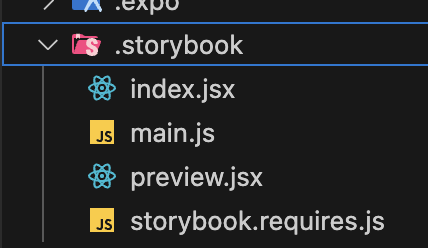

<p align="center">
  <a href="https://storybook.js.org/">
    
  </a>
</p>

<h1 align="center">
 FasTheDeveloper's Guide to Component Driven Development with Storybook React Native
</h1>

<h3 align="center">
React Native • TypeScript • Expo • Expo Router • StoryBook • Jest 
</h3>

## 🚀 Introduction

Welcome to this comprehensive, beginner-friendly guide on component-driven development using Storybook UI in React Native. This tutorial leverages the power of Expo and Expo Router to provide a robust learning experience.

## 🎯 What You'll Learn

1. Core principles of component-driven development
2. Harnessing Storybook UI to enhance your development workflow
3. Bootstrapping a React Native project with Expo
4. Seamlessly integrating Storybook UI into your Expo project
5. Implementing smooth navigation with Expo Router
6. Crafting and showcasing reusable components
7. Industry best practices for component-driven development

## 🛠 Prerequisites

Before diving in, make sure you have:

- A basic understanding of JavaScript and React
- Node.js and npm installed on your development machine
- Your preferred code editor ready to go

## 📚 Tutorial Sections

1. Introduction to Component-Driven Development
2. Setting Up Your Expo Project
3. Integrating Storybook UI
4. Creating Your First Component
5. Navigating with Expo Router
6. Building a Robust Component Library
7. Best Practices and Pro Tips

## Getting Started

### Using My Repository

To quickly get started with the pre-configured environment, follow these steps:

1. Clone the repository using:
    ```shell
        git clone https://github.com/FastheDeveloper/RN_ComponentDrivenDevelopment_Storybook.git
    ```

2. Navigate to the project directory and install the dependencies by running:
    ```shell
        yarn
    
    # or

        npm install
    ```

### Setting Up from Scratch


1. Creating your expo react native application:
    ```shell
        npx create-expo-stack@latest
    ```
    Running the above command will create a boilerplate application after asking a few configuration questions.
    
    <!--  -->
    

    <br/>

2. Setup Storybook In The Project

    ```shell
        npx storybook@latest init
    ```
    This will add a new folder (.storybook) in your project directory
    <br/>
    <br/>
    

<br/>

3. Additional Configuration

    1. Create an app.config.js File:

    This configuration facilitates easy switching between Storybook UI for testing and the actual React Native application.
    <br/>
    This file defines the storybookEnabled constant based on the environment variable STORYBOOK_ENABLED. This helps determine whether to render Storybook or the main application.

    ```javascript
    
    export default ({ config }) => ({
        ...config,
        name: 'My_App_Name',  
        slug: 'My_App_Name', 
        extra: {
            storybookEnabled: process.env.STORYBOOK_ENABLED,
        },
    });
    ```

    2. Update package.json File:

    In the package.json file, add these Storybook scripts. We use these to pass that environment variable to our application, which swaps the entry point to the Storybook UI using cross-env to make sure this works on all platforms (Windows/macOS/Linux).


    ```json
    {
        "scripts": {
            "storybook": "cross-env STORYBOOK_ENABLED='true' expo start",
            "storybook:ios": "cross-env STORYBOOK_ENABLED='true' expo ios",
            "storybook:android": "cross-env STORYBOOK_ENABLED='true' expo android"
        }
    }
    ```

4. Setup Entry point (/app/index.tsx) with the env variable

    ```javascript
    import React from 'react'
    import { StyleSheet, Text, View } from 'react-native'
    import Constants from 'expo-constants'


    function Page() {
    return (
        <View style={styles.container}>
        <View style={styles.main}>
            <Text className="text-white">This is the first page of your app.</Text>
        </View>
        </View>
    )
    }

    let AppEntryPoint = Page  

    if (Constants?.expoConfig?.extra?.storybookEnabled === 'true') {
    const StorybookUI = require('../.storybook').default
    AppEntryPoint = () => {
        return (
        <View style={{ flex: 1 }}>
            <StorybookUI />
        </View>
        )
    }
    }

    export default AppEntryPoint

    ```

5. Run the App for Testing:

    To test the app, you can use one of the following commands depending on your target platform:

    ```shell 
        # Run on iOS
        yarn ios
    
    # or 
    
        # Run on Android
        yarn android
    ```

6. Run Storybook  to test :
    ```shell 
        # Run on iOS
        yarn storybook:ios
    
    # or 
    
        # Run on Android
        yarn storybook:android
    ```
   
<br/>
<br/>

<br/>
<br/>


## 🤝 Contributing

We welcome contributions to enhance this tutorial. Feel free to submit issues or pull requests.

<!-- ## 📄 License

This project is licensed under the MIT License - see the [LICENSE.md](LICENSE.md) file for details. -->

## 👏 Acknowledgments

- Expo team for their stellar documentation
- Storybook community for their comprehensive guides
- React Native community for their ongoing support


## 🚧 Work in Progress

This guide is currently under construction. Check back soon for updates and new content!

Happy coding! 🎉
<!-- 
1.  **Create the application.**

    Use [degit](https://github.com/Rich-Harris/degit) to get this template.

    ```shell
    # Clone the template
    npx degit chromaui/intro-storybook-react-native-template#main taskbox
    ```

1.  **Install the dependencies.**

    Navigate into your new site’s directory and install the necessary dependencies.

    ```shell
    # Navigate to the directory
    cd taskbox/

    # Install the dependencies
    yarn
    ```

1.  **Open the source code and start editing!**

    Open the `taskbox` directory in your code editor of choice and building your first component!

1.  **Browse your stories!**

    Run `yarn storybook:ios` for ios or `yarn storybook:android` for android to see your component's stories on your emulator or device.

## 🔎 What's inside?

A quick look at the top-level files and directories included with this template.

    .
    ├── .gitignore
    ├── LICENSE
    ├── README.md
    ├── App.jsx
    ├── app.config.js
    ├── yarn.lock
    ├── package.json
    ├── babel.config.js

1.  **`.gitignore`**: This file tells git which files it should not track or maintain during the development process of your project.

2.  **`LICENSE`**: The template is licensed under the MIT licence.

3.  **`README.md`**: A text file containing useful reference information about the project.

4. **`App.jsx`**: This is the entry point of your app.  

5. **`app.config.js`**: This is the configuration file for Expo that allows you to customize your app.

6. **`yarn.lock`**: This is an automatically generated file based on the exact versions of your npm dependencies that were installed.

## Contribute

If you encounter an issue with the template, we encourage you to open an issue in this template's repository.

## Learning Storybook

1. Read our introductory tutorial at [Learn Storybook](https://storybook.js.org/tutorials/intro-to-storybook/react-native/en/get-started/).
2. Learn how to transform your component libraries into design systems in our [Design Systems for Developers](https://storybook.js.org/tutorials/design-systems-for-developers/) tutorial.
3. See our official documentation at [Storybook](https://storybook.js.org/). -->
